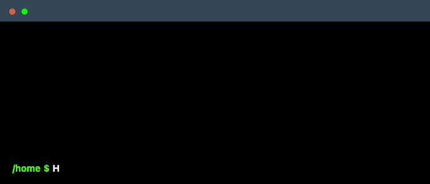

<h1 align="left">Hi 👋, I'm André</h1>

<picture>
  <source
    media="(prefers-color-scheme: dark)"
    srcset="https://readme-typing-svg.herokuapp.com?font=Fira+Code&size=22&duration=4000&pause=800&color=1A8FD8&background=0D1117&center=false&vCenter=true&width=1000&lines=%24+whoami"
  />
  <source
    media="(prefers-color-scheme: light)"
    srcset="https://readme-typing-svg.herokuapp.com?font=Fira+Code&size=22&duration=4000&pause=800&color=1A8FD8&background=FFFFFF&center=false&vCenter=true&width=1000&lines=%24+whoami"
  />
  
</picture>

I'm a Software Developer with a strong interest in building interactive, user-friendly, and visually engaging web applications. I enjoy transforming ideas and designs into clean, responsive, and intuitive interfaces. 

Outside of coding, I’m always learning, exploring new tools, looking for ways to improve both my technical skills and the overall quality of my work — or playing basketball when I need a break. 🤓

<h3 align="left">
Frontend-focused Software Developer 
React • Tailwind CSS • Node.js
</h3>

<!--
    Your own Terminal GIF can be created here -> https://www.terminalgif.com
-->

    

<h2 align="left">🌐 Portfolio</h2>

  <strong>Check out my Interactive 3D Portfolio: </strong> &nbsp; 
  

<h2 align="left">🚀 Overview</h2>

- 🔭 I’m currently working on [Admin Dashboard](https://github.com/andref218/admin_dashboard)

- 👨‍💻 All of my projects are available at [https://github.com/andref218](https://github.com/andref218)

<h2 align="left">🛠️ Tech Stack</h2>

  
  
  
  
  
  
  
  
  
  
  

<h2 align="left">📫 Contact & Links</h2>

<h2 align="left">🐍 GitHub Activity</h2>

  <picture>
    <source media="(prefers-color-scheme: dark)" srcset="./assets/github-snake-dark.svg">
    <source media="(prefers-color-scheme: light)" srcset="./assets/github-snake.svg">
    
  </picture>

